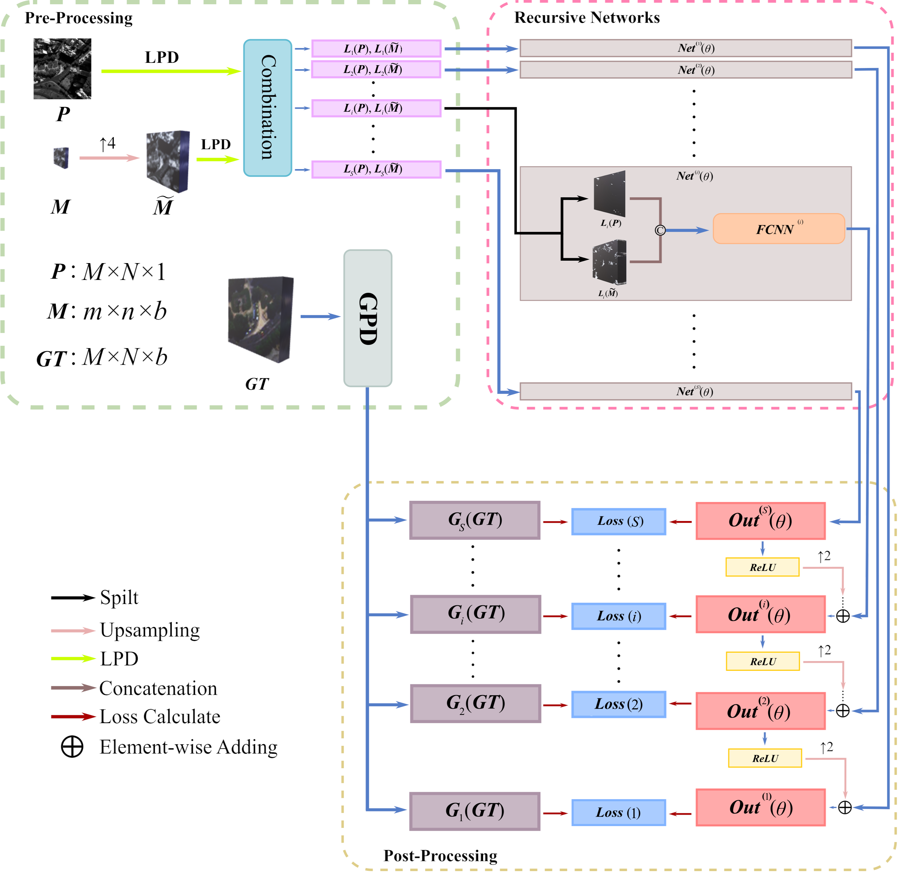
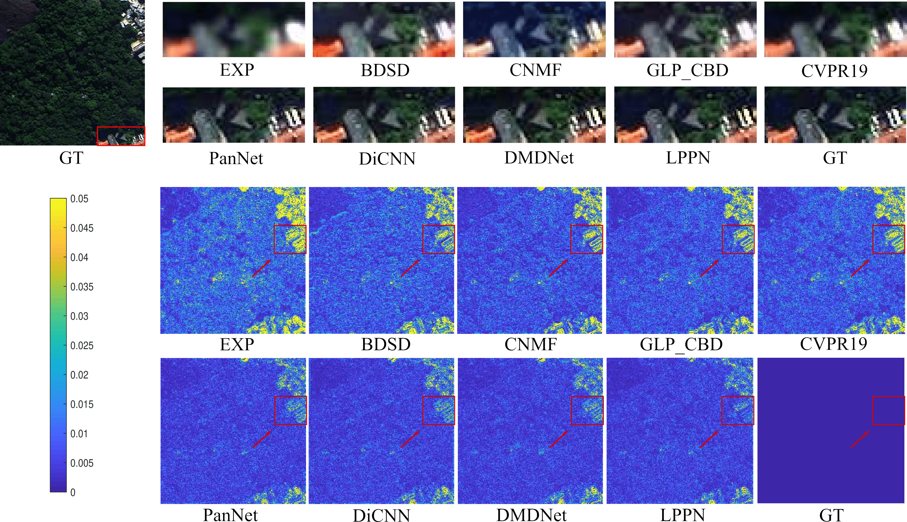

# Laplacian pyramid networks: A new approach for multispectral pansharpening

Homepage: 

[https://academic/](https://academic.peterkam.top/)

https://liangjiandeng.github.io/

https://sites.google.com/site/vivonegemine/

- Code for paper: "Laplacian pyramid networks: A new approach for multispectral pansharpening, Information Fusion"
- State-of-the-art pansharpening performance


# Dependencies and Installation
- Python 3.8 (Recommend to use [Anaconda](https://www.anaconda.com/))
- TensorFlow 1.14.0
- NVIDIA GPU + CUDA
- Python packages: `pip install numpy scipy h5py`
- TensorBoard


# Dataset Preparation
The datasets used in this paper is WorldView-3 (can be downloaded [here](https://www.maxar.com/product-samples/)), QuickBird (can be downloaded [here](https://earth.esa.int/eogateway/catalog/quickbird-full-archive)) and GaoFen-2 (can be downloaded [here](http://www.rscloudmart.com/dataProduct/sample)). Due to the copyright of dataset, we can not upload the datasets, you may download the data and simulate them according to the paper.


# Get Started
Training and testing codes are in '[codes/](./codes)'. Pretrained model can be found in '[codes/pretrained/](./codes/pretrained)'. All codes will be presented after the paper is completed published. Please refer to `codes/how-to-run.md` for detail description.

# LPPN Architecture


FCNN architecture is presented below:


# Results
### Quantitative results
The following quantitative results is generated from WorldView-3 datasets. A.T. is short for Average running Time for saving spaces in the paper.


All quantitative results can be found in '[results/](./results)'.

### Visual Results
The following visual results is generated from WorldView-3 datasets.



All visual results can be also found in '[results/](./results)'.

# Acknowledgement
Part of code of this work is derived from [https://xueyangfu.github.io/projects/LPNet.html](https://xueyangfu.github.io/projects/LPNet.html).

# Citation
```bib
@article{LPPN,
author = {Cheng Jin, Liang-Jian Deng, Ting-Zhu Huang and Gemine Vivone},
title = {Laplacian pyramid networks: A new approach for multispectral pansharpening},
journal = {Information Fusion},
volume = {78},
pages = {158-170},
year = {2022},
issn = {1566-2535},
doi = {https://doi.org/10.1016/j.inffus.2021.09.002}
}
```

# Contact
We are glad to hear from you. If you have any questions, please feel free to contact [Cheng.Jin@std.uestc.edu.cn](mailto:Cheng.Jin@std.uestc.edu.cn) or open issues on this repository.

# License
This project is open sourced under GNU Affero General Public License v3.0.
